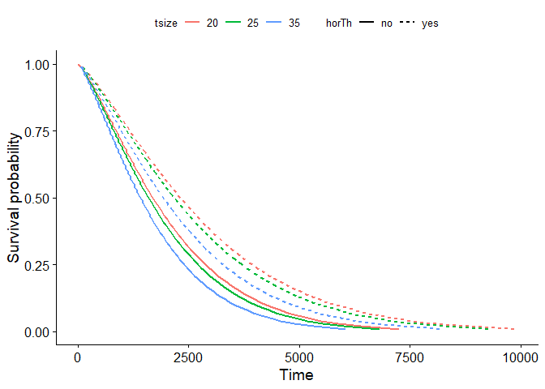

```r
# {r, echo = FALSE, results='hide'}
# if we used both 'echo=TRUE' and 'results=hide' the pipe would not work properly
# if we used 'echo = FALSE' and 'results=hide' we would have only messages (i.e. attaching package) If we don't want them we set 'error = FALSE', 'warning = FALSE', and 'message = FALSE'.
library(dplyr)
```

```
## 
## Attaching package: 'dplyr'
```

```
## The following objects are masked from 'package:stats':
## 
##     filter, lag
```

```
## The following objects are masked from 'package:base':
## 
##     intersect, setdiff, setequal, union
```


```r
# package for analysis
library(survival)

# package for visualization
library(survminer)
```

```
## Loading required package: ggplot2
```

```
## Loading required package: ggpubr
```

```r
# time to death of 686 breast cancer patients
data(GBSG2, package = "TH.data")

# time to re-employment of 3343 unemployed patients
data(UnempDur, package = "Ecdat")
```

## Plot a Weibul model


```r
# step 1: 
# compute weibul model
wbmod <- survreg(Surv(time, cens) ~ horTh + tsize, data = GBSG2)

# Decide on covariate combinations (imaginary patients)
newdat <- expand.grid(horTh = levels(GBSG2$horTh),
                      tsize = quantile(GBSG2$tsize,
                                       probs = c(0.25, 0.5, 0.75))  )

newdat
```

```
##   horTh tsize
## 1    no    20
## 2   yes    20
## 3    no    25
## 4   yes    25
## 5    no    35
## 6   yes    35
```

```r
# step 2: 
# compute survival curve
surv <- seq(.99, .01, by = -.01)
t <- predict(wbmod, type = "quantile", p = 1 - surv, newdata = newdat) 
dim(t)
```

```
## [1]  6 99
```

```r
t[, 1:7]
```

```
##          [,1]      [,2]     [,3]     [,4]     [,5]     [,6]     [,7]
## [1,] 65.86524 112.54061 154.2116 193.0603 230.0268 265.6298 300.1952
## [2,] 89.96016 153.71037 210.6256 263.6858 314.1755 362.8029 410.0131
## [3,] 61.97352 105.89102 145.0999 181.6531 216.4354 249.9348 282.4579
## [4,] 84.64477 144.62823 198.1805 248.1057 295.6121 341.3663 385.7870
## [5,] 54.86634  93.74733 128.4597 160.8209 191.6144 221.2720 250.0653
## [6,] 74.93762 128.04211 175.4530 219.6526 261.7110 302.2180 341.5445
```

```r
# Step 3:
# create a dataframe with survival curve information
surv_wbmod_wide <- cbind(newdat, t)
surv_wbmod_wide[, 1:7]
```

```
##   horTh tsize        1         2        3        4        5
## 1    no    20 65.86524 112.54061 154.2116 193.0603 230.0268
## 2   yes    20 89.96016 153.71037 210.6256 263.6858 314.1755
## 3    no    25 61.97352 105.89102 145.0999 181.6531 216.4354
## 4   yes    25 84.64477 144.62823 198.1805 248.1057 295.6121
## 5    no    35 54.86634  93.74733 128.4597 160.8209 191.6144
## 6   yes    35 74.93762 128.04211 175.4530 219.6526 261.7110
```

```r
library("reshape2")
surv_wbmod <- melt(surv_wbmod_wide, 
                   id.vars = c("horTh", "tsize"),    
                   variable.name = "surv_id",  
                   value.name = "time")

dim(surv_wbmod)
```

```
## [1] 594   4
```

```r
head(surv_wbmod, 12)
```

```
##    horTh tsize surv_id      time
## 1     no    20       1  65.86524
## 2    yes    20       1  89.96016
## 3     no    25       1  61.97352
## 4    yes    25       1  84.64477
## 5     no    35       1  54.86634
## 6    yes    35       1  74.93762
## 7     no    20       2 112.54061
## 8    yes    20       2 153.71037
## 9     no    25       2 105.89102
## 10   yes    25       2 144.62823
## 11    no    35       2  93.74733
## 12   yes    35       2 128.04211
```

```r
tail(surv_wbmod, 12)
```

```
##     horTh tsize surv_id     time
## 583    no    20      98 6397.460
## 584   yes    20      98 8737.788
## 585    no    25      98 6019.459
## 586   yes    25      98 8221.506
## 587    no    35      98 5329.141
## 588   yes    35      98 7278.655
## 589    no    20      99 7250.417
## 590   yes    20      99 9902.774
## 591    no    25      99 6822.018
## 592   yes    25      99 9317.658
## 593    no    35      99 6039.662
## 594   yes    35      99 8249.099
```

```r
surv_wbmod$surv <- surv[as.numeric(surv_wbmod$surv_id)]

head(surv_wbmod)
```

```
##   horTh tsize surv_id     time surv
## 1    no    20       1 65.86524 0.99
## 2   yes    20       1 89.96016 0.99
## 3    no    25       1 61.97352 0.99
## 4   yes    25       1 84.64477 0.99
## 5    no    35       1 54.86634 0.99
## 6   yes    35       1 74.93762 0.99
```

```r
surv_wbmod[, c("upper", "lower", "std.err", "strata")] <- NA

str(surv_wbmod)
```

```
## 'data.frame':	594 obs. of  9 variables:
##  $ horTh  : Factor w/ 2 levels "no","yes": 1 2 1 2 1 2 1 2 1 2 ...
##  $ tsize  : num  20 20 25 25 35 35 20 20 25 25 ...
##  $ surv_id: Factor w/ 99 levels "1","2","3","4",..: 1 1 1 1 1 1 2 2 2 2 ...
##  $ time   : num  65.9 90 62 84.6 54.9 ...
##  $ surv   : num  0.99 0.99 0.99 0.99 0.99 0.99 0.98 0.98 0.98 0.98 ...
##  $ upper  : logi  NA NA NA NA NA NA ...
##  $ lower  : logi  NA NA NA NA NA NA ...
##  $ std.err: logi  NA NA NA NA NA NA ...
##  $ strata : logi  NA NA NA NA NA NA ...
```

```r
# Step 4: plot

ggsurvplot_df(surv_wbmod, 
              surv.geom = geom_line,  
              linetype = "horTh", 
              color = "tsize", legend.title = NULL)
```

<!-- -->

