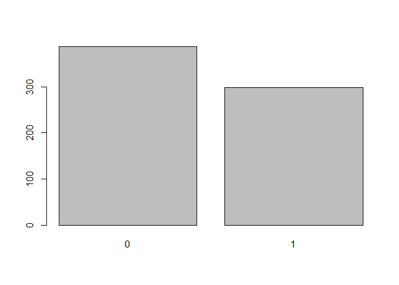
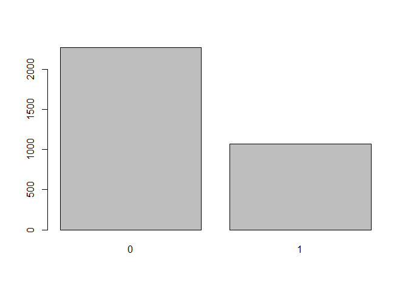
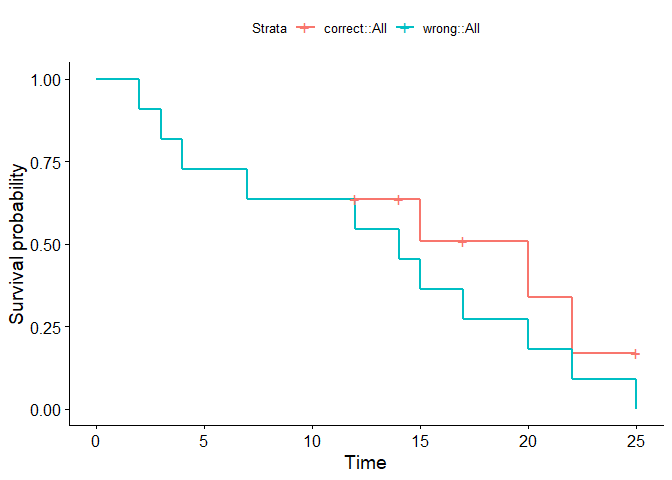
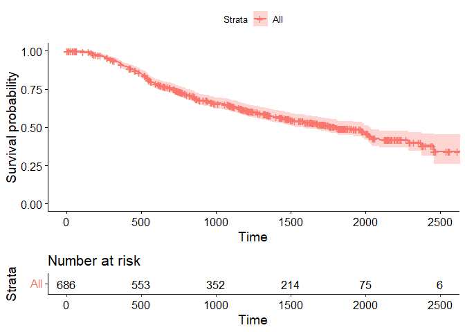
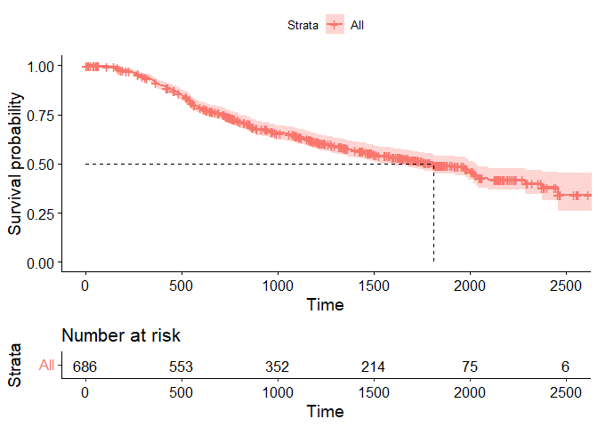
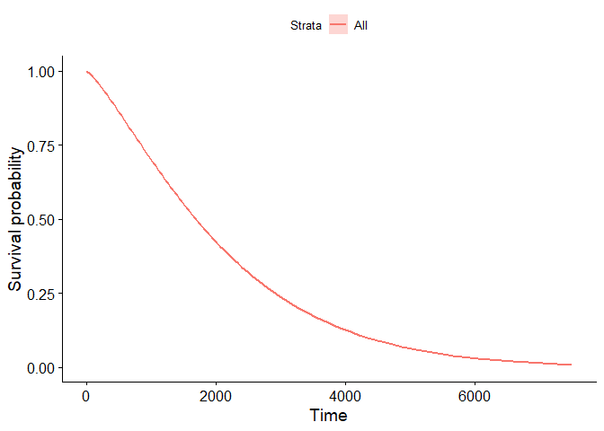

```r
# {r, echo = FALSE, results='hide'}
# if we used both 'echo=TRUE' and 'results=hide' the pipe would not work properly
# if we used 'echo = FALSE' and 'results=hide' we would have only messages (i.e. attaching package) If we don't want them we set 'error = FALSE', 'warning = FALSE', and 'message = FALSE'.
library(dplyr)
```

```
## 
## Attaching package: 'dplyr'
```

```
## The following objects are masked from 'package:stats':
## 
##     filter, lag
```

```
## The following objects are masked from 'package:base':
## 
##     intersect, setdiff, setequal, union
```


```r
# package for analysis
library(survival)

# package for visualization
library(survminer)
```

```
## Loading required package: ggplot2
```

```
## Loading required package: ggpubr
```

```r
# time to death of 686 breast cancer patients
data(GBSG2, package = "TH.data")

# time to re-employment of 3343 unemployed patients
data(UnempDur, package = "Ecdat")
```

# Introducing the GBSG2 dataset


```r
# Check out the help page for this dataset
# help(GBSG2, package = "TH.data")

# Look at the summary of the dataset
summary(GBSG2)
```

```
##  horTh          age        menostat       tsize        tgrade   
##  no :440   Min.   :21.00   Pre :290   Min.   :  3.00   I  : 81  
##  yes:246   1st Qu.:46.00   Post:396   1st Qu.: 20.00   II :444  
##            Median :53.00              Median : 25.00   III:161  
##            Mean   :53.05              Mean   : 29.33            
##            3rd Qu.:61.00              3rd Qu.: 35.00            
##            Max.   :80.00              Max.   :120.00            
##      pnodes         progrec           estrec             time       
##  Min.   : 1.00   Min.   :   0.0   Min.   :   0.00   Min.   :   8.0  
##  1st Qu.: 1.00   1st Qu.:   7.0   1st Qu.:   8.00   1st Qu.: 567.8  
##  Median : 3.00   Median :  32.5   Median :  36.00   Median :1084.0  
##  Mean   : 5.01   Mean   : 110.0   Mean   :  96.25   Mean   :1124.5  
##  3rd Qu.: 7.00   3rd Qu.: 131.8   3rd Qu.: 114.00   3rd Qu.:1684.8  
##  Max.   :51.00   Max.   :2380.0   Max.   :1144.00   Max.   :2659.0  
##       cens       
##  Min.   :0.0000  
##  1st Qu.:0.0000  
##  Median :0.0000  
##  Mean   :0.4359  
##  3rd Qu.:1.0000  
##  Max.   :1.0000
```

## Digging into the GBSG2 dataset 1


```r
# Count censored and uncensored data
num_cens <- table(GBSG2$cens)
num_cens
```

```
## 
##   0   1 
## 387 299
```

```r
# Create barplot of censored and uncensored data
barplot(num_cens)
```

<!-- -->

## Using the Surv() function for GBSG2


```r
# Create Surv-Object
sobj <- Surv(GBSG2$time, GBSG2$cens)

# Look at 10 first elements
sobj[1:10]
```

```
##  [1] 1814  2018   712  1807   772   448  2172+ 2161+  471  2014+
```

```r
GBSG2$time[1:10]
```

```
##  [1] 1814 2018  712 1807  772  448 2172 2161  471 2014
```

```r
GBSG2$cens[1:10]
```

```
##  [1] 1 1 1 1 1 1 0 0 1 0
```

```r
# Look at summary
summary(sobj)
```

```
##       time            status      
##  Min.   :   8.0   Min.   :0.0000  
##  1st Qu.: 567.8   1st Qu.:0.0000  
##  Median :1084.0   Median :0.0000  
##  Mean   :1124.5   Mean   :0.4359  
##  3rd Qu.:1684.8   3rd Qu.:1.0000  
##  Max.   :2659.0   Max.   :1.0000
```

```r
# Look at structure
str(sobj)
```

```
##  'Surv' num [1:686, 1:2] 1814  2018   712  1807   772   448  2172+ 2161+  471  2014+ ...
##  - attr(*, "dimnames")=List of 2
##   ..$ : NULL
##   ..$ : chr [1:2] "time" "status"
##  - attr(*, "type")= chr "right"
```

## The UnempDur dataset


```r
# Load the UnempDur data
data(UnempDur, package = "Ecdat")

# Count censored and uncensored data
cens_employ_ft <- table(UnempDur$censor1)
cens_employ_ft
```

```
## 
##    0    1 
## 2270 1073
```

```r
# Create barplot of censored and uncensored data
barplot(cens_employ_ft)
```

<!-- -->

```r
# Create Surv-Object
sobj <- Surv(UnempDur$spell, UnempDur$censor1)

# Look at 10 first elements
sobj[1:10]
```

```
##  [1]  5  13  21   3   9+ 11+  1+  3   7   5+
```

## First Kaplan-Meier estimate


```r
# Create time and event data
time <- c(5, 6, 2, 4, 4)
event <- c(1, 0, 0, 1, 1)

# Compute Kaplan-Meier estimate
km <- survfit(Surv(time, event) ~ 1)
km
```

```
## Call: survfit(formula = Surv(time, event) ~ 1)
## 
##       n  events  median 0.95LCL 0.95UCL 
##     5.0     3.0     4.5     4.0      NA
```

```r
# Take a look at the structure
str(km)
```

```
## List of 16
##  $ n        : int 5
##  $ time     : num [1:4] 2 4 5 6
##  $ n.risk   : num [1:4] 5 4 2 1
##  $ n.event  : num [1:4] 0 2 1 0
##  $ n.censor : num [1:4] 1 0 0 1
##  $ surv     : num [1:4] 1 0.5 0.25 0.25
##  $ std.err  : num [1:4] 0 0.5 0.866 0.866
##  $ cumhaz   : num [1:4] 0 0.5 1 1
##  $ std.chaz : num [1:4] 0 0.354 0.612 0.612
##  $ type     : chr "right"
##  $ logse    : logi TRUE
##  $ conf.int : num 0.95
##  $ conf.type: chr "log"
##  $ lower    : num [1:4] 1 0.1877 0.0458 0.0458
##  $ upper    : num [1:4] 1 1 1 1
##  $ call     : language survfit(formula = Surv(time, event) ~ 1)
##  - attr(*, "class")= chr "survfit"
```

```r
# Create data.frame
data.frame(time = km$time, n.risk = km$n.risk, n.event = km$n.event,
  n.censor = km$n.censor, surv = km$surv)
```

```
##   time n.risk n.event n.censor surv
## 1    2      5       0        1 1.00
## 2    4      4       2        0 0.50
## 3    5      2       1        0 0.25
## 4    6      1       0        1 0.25
```

## Exercise ignoring censoring


```r
# Create dancedat data
dancedat <- data.frame(
  name = c("Chris", "Martin", "Conny", "Desi", "Reni", "Phil", 
    "Flo", "Andrea", "Isaac", "Dayra", "Caspar"),
  time = c(20, 2, 14, 22, 3, 7, 4, 15, 25, 17, 12),
  obs_end = c(1, 1, 0, 1, 1, 1, 1, 1, 0, 0, 0))

# Estimate the survivor function pretending that all censored observations are actual observations. The Surv() function can also take only one argument if there is no censoring, i.e. Surv(time)
km_wrong <- survfit(Surv(time)~ 1, data = dancedat)

# Estimate the survivor function from this dataset via kaplan-meier.
km <- survfit(Surv(time, obs_end) ~ 1, data = dancedat)

# Plot the two and compare
ggsurvplot_combine(list(correct = km, wrong = km_wrong))
```

```
## Warning: `select_()` was deprecated in dplyr 0.7.0.
## Please use `select()` instead.
```

<!-- -->

## Estimating and visualizing a survival curve


```r
# Kaplan-Meier estimate
km <- survfit(Surv(time, cens) ~ 1, data = GBSG2)

# plot of the Kaplan-Meier estimate
ggsurvplot(km)
```

<!-- -->

```r
# add the risk table to plot
ggsurvplot(km, risk.table = TRUE)
```

<!-- -->

```r
# add a line showing the median survival time
ggsurvplot(km, risk.table = TRUE, surv.median.line = "hv")
```

<!-- -->

## Estimating median survival from a Weibull model


```r
# Weibull model
wb <- survreg(Surv(time, cens) ~ 1, data = GBSG2)

# Compute the median survival from the model
predict(wb, type = "quantile", p = 0.5, newdata = data.frame(1))
```

```
##       1 
## 1693.93
```

## Survival curve quantiles from a Weibull model


```r
# Weibull model
wb <- survreg(Surv(time, cens) ~ 1, data = GBSG2)

# 70 Percent of patients survive beyond time point...
predict(wb, type = "quantile", p = 1- 0.7, newdata = data.frame(1))
```

```
##        1 
## 1004.524
```

## Estimating the survival curve with survreg()


```r
# Weibull model
wb <- survreg(Surv(time, cens) ~ 1, data = GBSG2)

# Retrieve survival curve from model probabilities 
surv <- seq(.99, .01, by = -.01)

# Get time for each probability
t <- predict(wb, type = "quantile", p = 1 - surv, newdata = data.frame(1))

# Create data frame with the information
surv_wb <- data.frame(time = t, surv = surv)

# Look at first few lines of the result
head(surv_wb)
```

```
##       time surv
## 1  60.6560 0.99
## 2 105.0392 0.98
## 3 145.0723 0.97
## 4 182.6430 0.96
## 5 218.5715 0.95
## 6 253.3125 0.94
```

## Comparing Weibull model and Kaplan-Meier estimate


```r
# Weibull model
wb <- survreg(Surv(time, cens) ~ 1, data = GBSG2)

# Retrieve survival curve from model
surv <- seq(.99, .01, by = -.01)

# Get time for each probability
t <- predict(wb, type = "quantile", p = 1 - surv, newdata = data.frame(1))

# Create data frame with the information needed for ggsurvplot_df
surv_wb <- data.frame(time = t, surv = surv, 
  upper = NA, lower = NA, std.err = NA)

# Plot
ggsurvplot_df(fit = surv_wb, surv.geom = geom_line)
```

<!-- -->

