```r
# {r, echo = FALSE, results='hide'}
# if we used both 'echo=TRUE' and 'results=hide' the pipe would not work properly
# if we used 'echo = FALSE' and 'results=hide' we would have only messages (i.e. attaching package) If we don't want them we set 'error = FALSE', 'warning = FALSE', and 'message = FALSE'.
library(dplyr)
```

```
## 
## Attaching package: 'dplyr'
```

```
## The following objects are masked from 'package:stats':
## 
##     filter, lag
```

```
## The following objects are masked from 'package:base':
## 
##     intersect, setdiff, setequal, union
```


```r
# package for analysis
library(survival)

# package for visualization
library(survminer)
```

```
## Loading required package: ggplot2
```

```
## Loading required package: ggpubr
```

```r
# time to death of 686 breast cancer patients
data(GBSG2, package = "TH.data")

# time to re-employment of 3343 unemployed patients
data(UnempDur, package = "Ecdat")
```

# Introducing the GBSG2 dataset


```r
# Check out the help page for this dataset
# help(GBSG2, package = "TH.data")

# Look at the summary of the dataset
summary(GBSG2)
```

```
##  horTh          age        menostat       tsize        tgrade   
##  no :440   Min.   :21.00   Pre :290   Min.   :  3.00   I  : 81  
##  yes:246   1st Qu.:46.00   Post:396   1st Qu.: 20.00   II :444  
##            Median :53.00              Median : 25.00   III:161  
##            Mean   :53.05              Mean   : 29.33            
##            3rd Qu.:61.00              3rd Qu.: 35.00            
##            Max.   :80.00              Max.   :120.00            
##      pnodes         progrec           estrec             time       
##  Min.   : 1.00   Min.   :   0.0   Min.   :   0.00   Min.   :   8.0  
##  1st Qu.: 1.00   1st Qu.:   7.0   1st Qu.:   8.00   1st Qu.: 567.8  
##  Median : 3.00   Median :  32.5   Median :  36.00   Median :1084.0  
##  Mean   : 5.01   Mean   : 110.0   Mean   :  96.25   Mean   :1124.5  
##  3rd Qu.: 7.00   3rd Qu.: 131.8   3rd Qu.: 114.00   3rd Qu.:1684.8  
##  Max.   :51.00   Max.   :2380.0   Max.   :1144.00   Max.   :2659.0  
##       cens       
##  Min.   :0.0000  
##  1st Qu.:0.0000  
##  Median :0.0000  
##  Mean   :0.4359  
##  3rd Qu.:1.0000  
##  Max.   :1.0000
```

## Digging into the GBSG2 dataset 1


```r
# Count censored and uncensored data
num_cens <- table(GBSG2$cens)
num_cens
```

```
## 
##   0   1 
## 387 299
```

```r
# Create barplot of censored and uncensored data
barplot(num_cens)
```

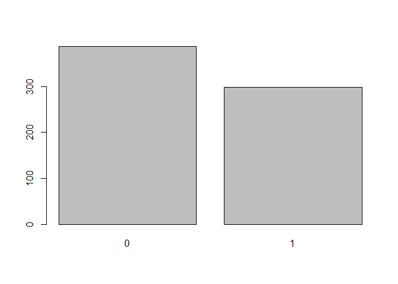<!-- -->

## Using the Surv() function for GBSG2


```r
# Create Surv-Object
sobj <- Surv(GBSG2$time, GBSG2$cens)

# Look at 10 first elements
sobj[1:10]
```

```
##  [1] 1814  2018   712  1807   772   448  2172+ 2161+  471  2014+
```

```r
GBSG2$time[1:10]
```

```
##  [1] 1814 2018  712 1807  772  448 2172 2161  471 2014
```

```r
GBSG2$cens[1:10]
```

```
##  [1] 1 1 1 1 1 1 0 0 1 0
```

```r
# Look at summary
summary(sobj)
```

```
##       time            status      
##  Min.   :   8.0   Min.   :0.0000  
##  1st Qu.: 567.8   1st Qu.:0.0000  
##  Median :1084.0   Median :0.0000  
##  Mean   :1124.5   Mean   :0.4359  
##  3rd Qu.:1684.8   3rd Qu.:1.0000  
##  Max.   :2659.0   Max.   :1.0000
```

```r
# Look at structure
str(sobj)
```

```
##  'Surv' num [1:686, 1:2] 1814  2018   712  1807   772   448  2172+ 2161+  471  2014+ ...
##  - attr(*, "dimnames")=List of 2
##   ..$ : NULL
##   ..$ : chr [1:2] "time" "status"
##  - attr(*, "type")= chr "right"
```

## The UnempDur dataset


```r
# Load the UnempDur data
data(UnempDur, package = "Ecdat")

# Count censored and uncensored data
cens_employ_ft <- table(UnempDur$censor1)
cens_employ_ft
```

```
## 
##    0    1 
## 2270 1073
```

```r
# Create barplot of censored and uncensored data
barplot(cens_employ_ft)
```

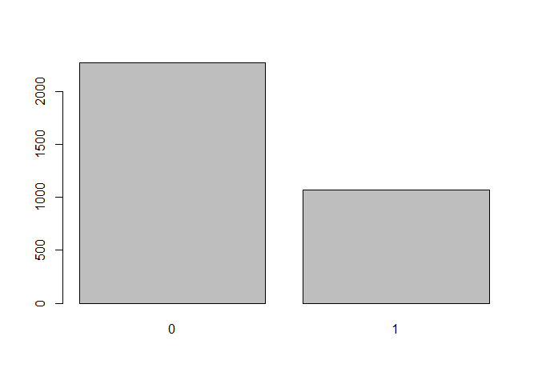<!-- -->

```r
# Create Surv-Object
sobj <- Surv(UnempDur$spell, UnempDur$censor1)

# Look at 10 first elements
sobj[1:10]
```

```
##  [1]  5  13  21   3   9+ 11+  1+  3   7   5+
```

## First Kaplan-Meier estimate


```r
# Create time and event data
time <- c(5, 6, 2, 4, 4)
event <- c(1, 0, 0, 1, 1)

# Compute Kaplan-Meier estimate
km <- survfit(Surv(time, event) ~ 1)
km
```

```
## Call: survfit(formula = Surv(time, event) ~ 1)
## 
##       n  events  median 0.95LCL 0.95UCL 
##     5.0     3.0     4.5     4.0      NA
```

```r
# Take a look at the structure
str(km)
```

```
## List of 16
##  $ n        : int 5
##  $ time     : num [1:4] 2 4 5 6
##  $ n.risk   : num [1:4] 5 4 2 1
##  $ n.event  : num [1:4] 0 2 1 0
##  $ n.censor : num [1:4] 1 0 0 1
##  $ surv     : num [1:4] 1 0.5 0.25 0.25
##  $ std.err  : num [1:4] 0 0.5 0.866 0.866
##  $ cumhaz   : num [1:4] 0 0.5 1 1
##  $ std.chaz : num [1:4] 0 0.354 0.612 0.612
##  $ type     : chr "right"
##  $ logse    : logi TRUE
##  $ conf.int : num 0.95
##  $ conf.type: chr "log"
##  $ lower    : num [1:4] 1 0.1877 0.0458 0.0458
##  $ upper    : num [1:4] 1 1 1 1
##  $ call     : language survfit(formula = Surv(time, event) ~ 1)
##  - attr(*, "class")= chr "survfit"
```

```r
# Create data.frame
data.frame(time = km$time, n.risk = km$n.risk, n.event = km$n.event,
  n.censor = km$n.censor, surv = km$surv)
```

```
##   time n.risk n.event n.censor surv
## 1    2      5       0        1 1.00
## 2    4      4       2        0 0.50
## 3    5      2       1        0 0.25
## 4    6      1       0        1 0.25
```

## Exercise ignoring censoring


```r
# Create dancedat data
dancedat <- data.frame(
  name = c("Chris", "Martin", "Conny", "Desi", "Reni", "Phil", 
    "Flo", "Andrea", "Isaac", "Dayra", "Caspar"),
  time = c(20, 2, 14, 22, 3, 7, 4, 15, 25, 17, 12),
  obs_end = c(1, 1, 0, 1, 1, 1, 1, 1, 0, 0, 0))

# Estimate the survivor function pretending that all censored observations are actual observations. The Surv() function can also take only one argument if there is no censoring, i.e. Surv(time)
km_wrong <- survfit(Surv(time)~ 1, data = dancedat)

# Estimate the survivor function from this dataset via kaplan-meier.
km <- survfit(Surv(time, obs_end) ~ 1, data = dancedat)

# Plot the two and compare
ggsurvplot_combine(list(correct = km, wrong = km_wrong))
```

```
## Warning: `select_()` was deprecated in dplyr 0.7.0.
## Please use `select()` instead.
```

<!-- -->

## Estimating and visualizing a survival curve


```r
# Kaplan-Meier estimate
km <- survfit(Surv(time, cens) ~ 1, data = GBSG2)

# plot of the Kaplan-Meier estimate
ggsurvplot(km)
```

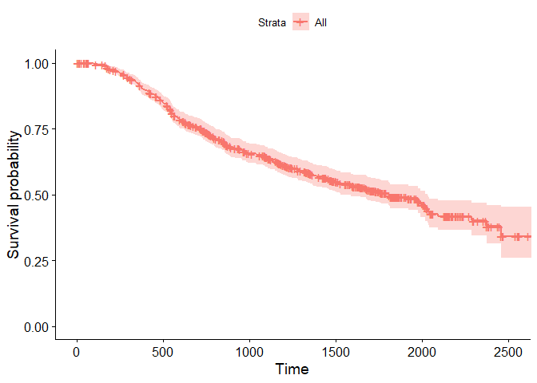<!-- -->

```r
# add the risk table to plot
ggsurvplot(km, risk.table = TRUE)
```

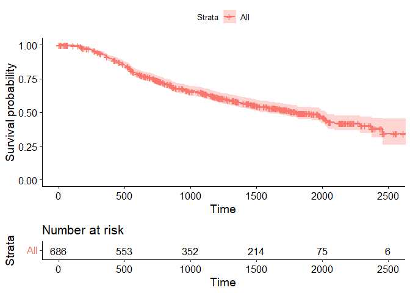<!-- -->

```r
# add a line showing the median survival time
ggsurvplot(km, risk.table = TRUE, surv.median.line = "hv")
```

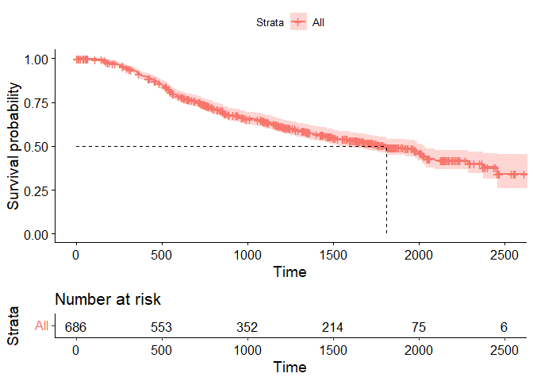<!-- -->

## Estimating median survival from a Weibull model


```r
# Weibull model
wb <- survreg(Surv(time, cens) ~ 1, data = GBSG2)

# Compute the median survival from the model
predict(wb, type = "quantile", p = 0.5, newdata = data.frame(1))
```

```
##       1 
## 1693.93
```

## Survival curve quantiles from a Weibull model


```r
# Weibull model
wb <- survreg(Surv(time, cens) ~ 1, data = GBSG2)

# 70 Percent of patients survive beyond time point...
predict(wb, type = "quantile", p = 1- 0.7, newdata = data.frame(1))
```

```
##        1 
## 1004.524
```

## Estimating the survival curve with survreg()


```r
# Weibull model
wb <- survreg(Surv(time, cens) ~ 1, data = GBSG2)

# Retrieve survival curve from model probabilities 
surv <- seq(.99, .01, by = -.01)

# Get time for each probability
t <- predict(wb, type = "quantile", p = 1 - surv, newdata = data.frame(1))

# Create data frame with the information
surv_wb <- data.frame(time = t, surv = surv)

# Look at first few lines of the result
head(surv_wb)
```

```
##       time surv
## 1  60.6560 0.99
## 2 105.0392 0.98
## 3 145.0723 0.97
## 4 182.6430 0.96
## 5 218.5715 0.95
## 6 253.3125 0.94
```

## Comparing Weibull model and Kaplan-Meier estimate


```r
# Weibull model
wb <- survreg(Surv(time, cens) ~ 1, data = GBSG2)

# Retrieve survival curve from model
surv <- seq(.99, .01, by = -.01)

# Get time for each probability
t <- predict(wb, type = "quantile", p = 1 - surv, newdata = data.frame(1))

# Create data frame with the information needed for ggsurvplot_df
surv_wb <- data.frame(time = t, surv = surv, 
  upper = NA, lower = NA, std.err = NA)

# Plot
ggsurvplot_df(fit = surv_wb, surv.geom = geom_line)
```

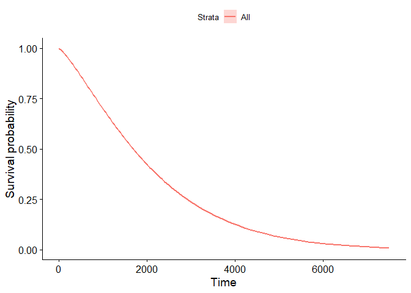<!-- -->

## Interpreting coefficents


```r
# Look at a new data set of lung cancer patients
str(dat)
```

```
## 'data.frame':	228 obs. of  3 variables:
##  $ time  : num  306 455 1010 210 883 ...
##  $ status: num  2 2 1 2 2 1 2 2 2 2 ...
##  $ sex   : Factor w/ 2 levels "male","female": 1 1 1 1 1 1 2 2 1 1 ...
```

```r
# Estimate a Weibull model
wbmod <- survreg(Surv(time, status) ~ sex, data = dat)
coef(wbmod)
```

```
## (Intercept)   sexfemale 
##    5.884162    0.395578
```

## Compute Weibull model


```r
# Weibull model
wbmod <- survreg(Surv(time, cens) ~ horTh, data = GBSG2)

# Retrieve survival curve from model
surv <- seq(.99, .01, by = -.01)
t_yes <- predict(wbmod, type = "quantile", p = 1 - surv,
  newdata = data.frame(horTh = "yes"))

# Take a look at survival curve
str(t_yes)
```

```
##  num [1:99] 76.4 131.4 180.9 227.2 271.4 ...
```

Note that if we put `newdata = data.farme(horTh = 2)` in the above code, we would get an error.

## Computing a Weibull model and the survival curves


```r
# Weibull model
wbmod <- survreg(Surv(time, cens) ~ horTh + tsize, data = GBSG2)

# Imaginary patients
newdat <- expand.grid(
  horTh = levels(GBSG2$horTh),
  tsize = quantile(GBSG2$tsize, probs = c(0.25, 0.5, 0.75)))

# Compute survival curves
surv <- seq(.99, .01, by = -.01)
t <- predict(wbmod, type = "quantile", p = 1 - surv,
  newdata = newdat)

# How many rows and columns does t have?
dim(t)
```

```
## [1]  6 99
```

```r
# Each row of t corresponds to one covariate combination (one imaginary patient) and each column to one value of surv.
```

## Visualising a Weibull model


```r
# Use cbind() to combine the information in newdat with t
surv_wbmod_wide <- cbind(newdat, t)
  
# Use melt() to bring the data.frame to long format
library(reshape2)
surv_wbmod <- melt(surv_wbmod_wide, id.vars = c("horTh", "tsize"), variable.name = "surv_id", value.name = "time")

# Use surv_wbmod$surv_id to add the correct survival probabilities surv
surv_wbmod$surv <- surv[as.numeric(surv_wbmod$surv_id)]

# Add columns upper, lower, std.err, and strata to the data.frame
surv_wbmod[, c("upper", "lower", "std.err", "strata")] <- NA

# Plot the survival curves
ggsurvplot_df(surv_wbmod, surv.geom = geom_line,
  linetype = "horTh", color = "tsize", legend.title = NULL)
```

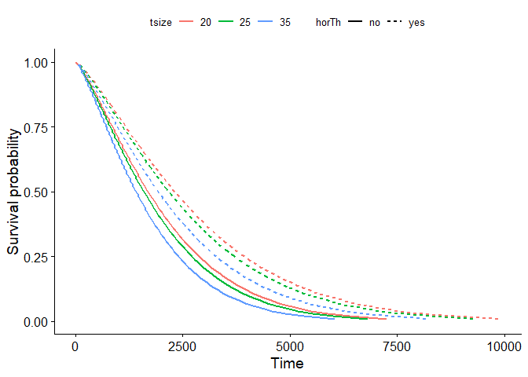<!-- -->

## Computing a Weibull and a log-normal model


```r
# Weibull model
wbmod <- survreg(Surv(time, cens) ~ horTh, data = GBSG2)

# Log-Normal model
lnmod <- survreg(Surv(time, cens) ~ horTh, data = GBSG2, dist = "lognormal")

# Newdata
newdat <- data.frame(horTh = levels(GBSG2$horTh))

# Surv
surv <- seq(.99, .01, by = -.01)

# Survival curve from Weibull model and log-normal model
wbt <- predict(wbmod, type = "quantile", p = 1 - surv, newdata = newdat)
lnt <- predict(lnmod, type = "quantile", p = 1 - surv, newdata = newdat)
```

## Comparing Weibull and Log-Normal Model


```r
# Create a wide data frame containing hormonal therapy information and the survival curves for the Weibull and log-normal models.
surv_wide <- rbind(cbind(newdat, wbt), cbind(newdat, lnt))
surv_wide$dist <- c("weibull", "weibull", "lognormal", "lognormal")

surv_wide[, 1:5]
```

```
##   horTh         1        2        3        4
## 1    no  56.22822  96.7997 133.2302 167.3203
## 2   yes  76.35316 131.4458 180.9154 227.2068
## 3    no 114.89760 155.1218 187.6650 216.5724
## 4   yes 157.88615 213.1601 257.8792 297.6023
```

```r
surv_wide[, ncol(surv_wide) - 4]
```

```
## [1]  5003.958  6794.951 10233.507 14062.339
```

```r
# Melt the data.frame into long format.
surv_long <- melt(surv_wide, id.vars = c("horTh", "dist"), variable.name = "surv_id", value.name = "time")

# Add column for the survival probabilities
surv_long$surv <- surv[as.numeric(surv_long$surv_id)]

# Add columns upper, lower, std.err, and strata contianing NA values
surv_long[, c("upper", "lower", "std.err", "strata")] <- NA

# Plot the survival curves
ggsurvplot_df(surv_long, surv.geom = geom_line,
              linetype = "horTh", color = "dist", legend.title = NULL)
```

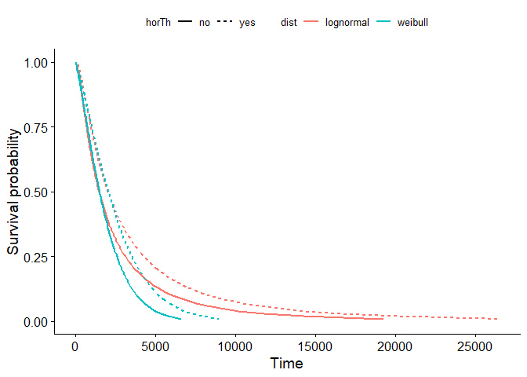<!-- -->

## Computing a Cox model


```r
# Compute Cox model
cxmod <- coxph(Surv(time, status) ~ performance, data = dat)

# Show model coefficient
coef(cxmod)
```

## Computing the survival curve from a Cox model


```r
# Cox model
cxmod <- coxph(Surv(time, cens) ~ horTh + tsize, data = GBSG2)

# Imaginary patients
newdat <- expand.grid(
  horTh = levels(GBSG2$horTh),
  tsize = quantile(GBSG2$tsize, probs = c(0.25, 0.5, 0.75)))
rownames(newdat) <- letters[1:6] # Those are stratum names, we need them.

# explore newdat
newdat
```

```
##   horTh tsize
## a    no    20
## b   yes    20
## c    no    25
## d   yes    25
## e    no    35
## f   yes    35
```

```r
# Compute survival curves
cxsf <- survfit(cxmod, data = GBSG2, newdata = newdat, conf.type = "none")

# look at he structure of cxsf
str(cxsf)
```

```
## List of 10
##  $ n       : int 686
##  $ time    : num [1:574] 8 15 16 17 18 29 42 46 57 63 ...
##  $ n.risk  : num [1:574] 686 685 684 683 681 680 679 678 677 676 ...
##  $ n.event : num [1:574] 0 0 0 0 0 0 0 0 0 0 ...
##  $ n.censor: num [1:574] 1 1 1 2 1 1 1 1 1 1 ...
##  $ surv    : num [1:574, 1:6] 1 1 1 1 1 1 1 1 1 1 ...
##   ..- attr(*, "dimnames")=List of 2
##   .. ..$ : NULL
##   .. ..$ : chr [1:6] "a" "b" "c" "d" ...
##  $ cumhaz  : num [1:574, 1:6] 0 0 0 0 0 0 0 0 0 0 ...
##  $ std.err : num [1:574, 1:6] 0 0 0 0 0 0 0 0 0 0 ...
##  $ logse   : logi TRUE
##  $ call    : language survfit(formula = cxmod, newdata = newdat, conf.type = "none", data = GBSG2)
##  - attr(*, "class")= chr [1:2] "survfitcox" "survfit"
```

```r
# What does cxsf look ike? (not very useful!)
cxsf
```

```
## Call: survfit(formula = cxmod, newdata = newdat, conf.type = "none", 
##     data = GBSG2)
## 
##     n events median
## a 686    299   1814
## b 686    299   2456
## c 686    299   1684
## d 686    299   2372
## e 686    299   1388
## f 686    299   2030
```

```r
# Look at first 6 rows of cxsf$surv and time points
head(cxsf$surv)
```

```
##      a b c d e f
## [1,] 1 1 1 1 1 1
## [2,] 1 1 1 1 1 1
## [3,] 1 1 1 1 1 1
## [4,] 1 1 1 1 1 1
## [5,] 1 1 1 1 1 1
## [6,] 1 1 1 1 1 1
```

```r
head(cxsf$time)
```

```
## [1]  8 15 16 17 18 29
```

## Visualizing a Cox model

`surv_summary()` is a function that returns a data.frame containing a nice summary from `survfit()` results, including columns like time (survival time) and surv (survival probability).


```r
# Compute data.frame needed for plotting
surv_cxmod0 <- surv_summary(cxsf)
str(surv_cxmod0)
```

```
## 'data.frame':	3444 obs. of  9 variables:
##  $ time    : num  8 15 16 17 18 29 42 46 57 63 ...
##  $ n.risk  : num  686 685 684 683 681 680 679 678 677 676 ...
##  $ n.event : num  0 0 0 0 0 0 0 0 0 0 ...
##  $ n.censor: num  1 1 1 2 1 1 1 1 1 1 ...
##  $ surv    : num  1 1 1 1 1 1 1 1 1 1 ...
##  $ std.err : num  0 0 0 0 0 0 0 0 0 0 ...
##  $ upper   : logi  NA NA NA NA NA NA ...
##  $ lower   : logi  NA NA NA NA NA NA ...
##  $ strata  : Factor w/ 6 levels "a","b","c","d",..: 1 1 1 1 1 1 1 1 1 1 ...
##  - attr(*, "table")='data.frame':	6 obs. of  7 variables:
##   ..$ records   : num [1:6] 686 686 686 686 686 686
##   ..$ n.max     : num [1:6] 686 686 686 686 686 686
##   ..$ n.start   : num [1:6] 686 686 686 686 686 686
##   ..$ events    : num [1:6] 299 299 299 299 299 299
##   ..$ *rmean    : num [1:6] 1671 1910 1617 1865 1507 ...
##   ..$ *se(rmean): num [1:6] 41.4 51.4 39.2 49.4 34.9 ...
##   ..$ median    : num [1:6] 1814 2456 1684 2372 1388 ...
```

```r
dim(surv_cxmod0)
```

```
## [1] 3444    9
```

```r
head(surv_cxmod0)
```

```
##   time n.risk n.event n.censor surv std.err upper lower strata
## 1    8    686       0        1    1       0    NA    NA      a
## 2   15    685       0        1    1       0    NA    NA      a
## 3   16    684       0        1    1       0    NA    NA      a
## 4   17    683       0        2    1       0    NA    NA      a
## 5   18    681       0        1    1       0    NA    NA      a
## 6   29    680       0        1    1       0    NA    NA      a
```

```r
tail(surv_cxmod0)
```

```
##      time n.risk n.event n.censor      surv   std.err upper lower strata
## 3439 2539      6       0        1 0.3926874 0.1464721    NA    NA      f
## 3440 2551      5       0        1 0.3926874 0.1464721    NA    NA      f
## 3441 2556      4       0        1 0.3926874 0.1464721    NA    NA      f
## 3442 2563      3       0        1 0.3926874 0.1464721    NA    NA      f
## 3443 2612      2       0        1 0.3926874 0.1464721    NA    NA      f
## 3444 2659      1       0        1 0.3926874 0.1464721    NA    NA      f
```

```r
# Get a character vector of patient letters (patient IDs)
pid <- as.character(surv_cxmod0$strata)
length(pid)
```

```
## [1] 3444
```

```r
head(pid, 12)
```

```
##  [1] "a" "a" "a" "a" "a" "a" "a" "a" "a" "a" "a" "a"
```

```r
tail(pid, 12)
```

```
##  [1] "f" "f" "f" "f" "f" "f" "f" "f" "f" "f" "f" "f"
```

```r
# Multiple of the rows in newdat so that it fits with surv_cxmod0
m_newdat <- newdat[pid, ]
dim(m_newdat)
```

```
## [1] 3444    2
```

```r
head(m_newdat)
```

```
##     horTh tsize
## a      no    20
## a.1    no    20
## a.2    no    20
## a.3    no    20
## a.4    no    20
## a.5    no    20
```

```r
tail(m_newdat)
```

```
##       horTh tsize
## f.568   yes    35
## f.569   yes    35
## f.570   yes    35
## f.571   yes    35
## f.572   yes    35
## f.573   yes    35
```

```r
# Add patient info to data.frame
surv_cxmod <- cbind(surv_cxmod0, m_newdat)

# Plot
ggsurvplot_df(surv_cxmod, linetype = "horTh", color = "tsize",
  legend.title = NULL, censor = FALSE)
```

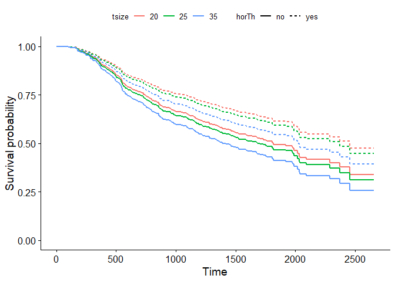<!-- -->

## Capstone: The Cox model


```r
# Compute Cox model and survival curves
cxmod <- coxph(Surv(time, status) ~ performance, data = lung)
new_lung <- data.frame(performance = c(60, 70, 80, 90))
cxsf <- survfit(cxmod, data = lung, newdata = new_lung, conf.type = "none")

# Use the summary of cxsf to take a vector of patient IDs
surv_cxmod0 <- surv_summary(cxsf)
pid <- as.character(surv_cxmod0$strata)

# Duplicate rows in newdat to fit with surv_cxmod0 and add them in
m_newdat <- new_lung[pid, , drop = FALSE]
surv_cxmod <- cbind(surv_cxmod0, m_newdat)

# Plot
ggsurvplot_df(surv_cxmod, color = "performance", legend.title = NULL, censor = FALSE)
```

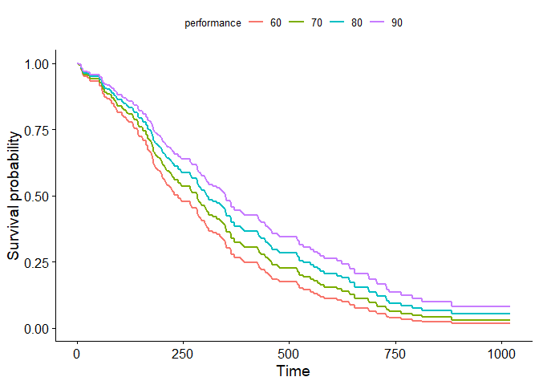<!-- -->

## Capstone: Comparing survival curves


```r
# Compute Kaplan-Meier curve
km <- survfit(Surv(time, status) ~ 1, data = lung)

# Compute Cox model
cxmod <- coxph(Surv(time, status) ~ performance, data = lung)

# Compute Cox model survival curves
new_lung <- data.frame(performance = c(60, 70, 80, 90))
cxsf <- survfit(cxmod, data = lung, newdata = new_lung, conf.type = "none")

# Plot Kaplan-Meier curve
ggsurvplot(km, conf.int = FALSE)
```

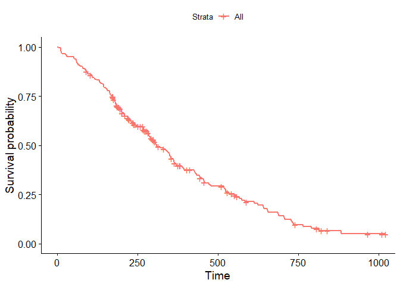<!-- -->

```r
# Plot Cox model survival curves
ggsurvplot(cxsf, censor = FALSE)
```

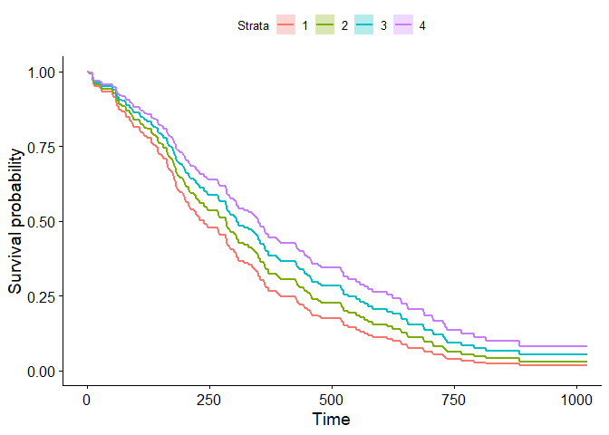<!-- -->

## Where do we go from here?

Check out CRAN task view.
